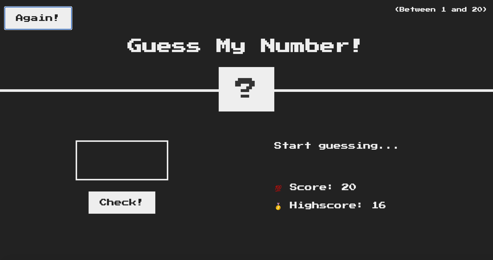

# GuessTheNumber-Project

This simple project was just a way of getting myself more acquainted with Javascript, especially when it comes to its ability to do DOM manipulation.

The goal of this game is to guess which number the application "guesses" (that "guess" is just a random number between 1 and 20). The player can try 20 times (it can be lowered, has the amount of times is declared in a constant variable) in each round. When he picks the right number, the app will register the amount of tries the player has left and declares it as his "record", enabling him to play again in order to increase his score.

Below there is an image showing how the app looks like:

